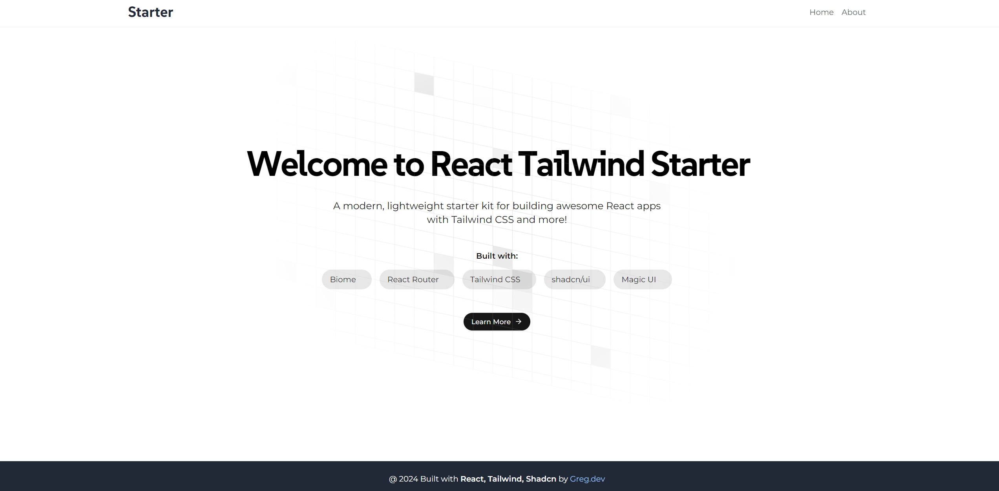

# React Tailwind Starter

A modern, lightweight starter kit for building awesome React applications with Tailwind CSS and more!



## Features

- React 18 with TypeScript
- Vite for fast development and building
- Tailwind CSS for utility-first styling
- shadcn/ui for beautifully designed, accessible components
- React Router for client-side routing
- Framer Motion for smooth animations
- Biome for linting and formatting
- Custom components and utilities for enhanced UI/UX
- Easy-peasy for state management
- Tanstack React Query for data fetching and caching
- Axios for HTTP requests
- Custom components based on shadcn/ui

## Tech Stack

- [React](https://reactjs.org/)
- [TypeScript](https://www.typescriptlang.org/)
- [Vite](https://vitejs.dev/)
- [Tailwind CSS](https://tailwindcss.com/)
- [shadcn/ui](https://ui.shadcn.com/)
- [React Router](https://reactrouter.com/)
- [Framer Motion](https://www.framer.com/motion/)
- [Biome](https://biomejs.dev/)
- [Easy-peasy](https://easy-peasy.vercel.app/)
- [Tanstack React Query](https://tanstack.com/query/latest)
- [Axios](https://axios-http.com/)

## Getting Started

1. Clone the repository
2. Install dependencies:
   ```bash
   npm install
   ```
3. Start the development server:
   ```bash
   npm run dev
   ```

## Available Scripts

- `npm run dev`: Start the development server
- `npm run build`: Build the production-ready application
- `npm run lint`: Run Biome linter
- `npm run preview`: Preview the built application

## Project Structure

- `src/`: Source files
  - `components/`: Reusable React components
    - `customs/`: Custom components based on shadcn/ui
    - `ui/`: shadcn/ui components
    - `animations/`: Animation components
  - `layout/`: Layout components (Header, Footer, Layout)
  - `pages/`: Page components
  - `lib/`: Utility functions
  - `hooks/`: Custom React hooks
  - `store/`: Easy-peasy store and related files
- `public/`: Static assets

## Custom Components

This starter includes several custom components to enhance your development experience:

1. Animated Grid Pattern
2. Particles Animation
3. Gradual Spacing Text Animation
4. Custom Accordion
5. Custom Carousel
6. Custom Drawer
7. Custom Dropdown
8. Custom Form
9. Custom Input
10. Custom Select

## State Management and Data Fetching

- Easy-peasy for global state management
- Tanstack React Query for efficient data fetching and caching
- Axios for making HTTP requests

## Customization

- Tailwind CSS configuration: `tailwind.config.js`
- Biome configuration: `biome.json`
- TypeScript configuration: `tsconfig.json` and `tsconfig.app.json`
- ESLint configuration: `eslint.config.js`

## Contributing

Contributions are welcome! Please feel free to submit a Pull Request.

## Portfolio: GitHub data & environment

- **`npm run build`** runs `prebuild` first, which executes `scripts/fetchGitHub.ts` and writes fresh data to `src/data/github.json`. Set **`GITHUB_TOKEN`** (classic fine-grained PAT with `public_repo` or read-only metadata) on Vercel / CI for higher rate limits; unauthenticated requests are capped at 60/hour per IP.
- **`VITE_SITE_URL`** — canonical origin for Open Graph, Twitter, JSON-LD, `robots.txt`, and `sitemap.xml` (default `https://gzmaster.dev`).
- **`VITE_CONTACT_EMAIL`** — optional; when set, the Contact section uses `mailto:` for the primary button. Otherwise it links to RetroDevs.
- **`VITE_GITHUB_USERNAME`** — optional; used in JSON-LD `sameAs` (default `GZMaster`).
- **`VITE_TWITTER_HANDLE`** — optional; injects `twitter:site` and `twitter:creator` on build (with or without `@`).
- **`VITE_GOOGLE_SITE_VERIFICATION`** / **`VITE_BING_SITE_VERIFICATION`** — optional; injects Search Console / Bing Webmaster meta tags on build.
- **Résumé (PDF)** — keep [`public/daniel-ohiosumua-resume.pdf`](public/daniel-ohiosumua-resume.pdf) in sync with your latest CV (same file the site offers for download). Structured copy for the UI and SEO lives in [`src/data/resume.ts`](src/data/resume.ts) — update names, dates, bullets, and `projectLinks` when your experience changes.


- **`index.html` is rewritten on each `vite build`**: dynamic `<title>`, meta description (from GitHub bio when present, trimmed to ~158 characters), `author`, `robots`, `theme-color`, canonical URL, `hreflang` (`en` + `x-default`), Open Graph + Twitter tags (including `og:image:alt`), and optional verification / Twitter meta from the env vars above.
- **JSON-LD** (`WebSite`, `WebPage`, `Person` with `sameAs` for GitHub + RetroDevs) is embedded for rich results.
- **`dist/robots.txt`** and **`dist/sitemap.xml`** are emitted on build. Submit the sitemap in [Google Search Console](https://search.google.com/search-console) and Bing Webmaster Tools after deploy.

## Vercel Web Analytics

- The app mounts [`@vercel/analytics`](https://vercel.com/docs/analytics) via **`@vercel/analytics/react`** (correct for Vite + React; do **not** use `@vercel/analytics/next` unless you migrate to Next.js).
- In the [Vercel dashboard](https://vercel.com/dashboard), open your project → **Analytics** → enable **Web Analytics**. Deployments on Vercel will then receive page views, visitors, and top paths. Local `npm run dev` typically does not send production data.

## License

This project is open source and available under the [MIT License](LICENSE).
